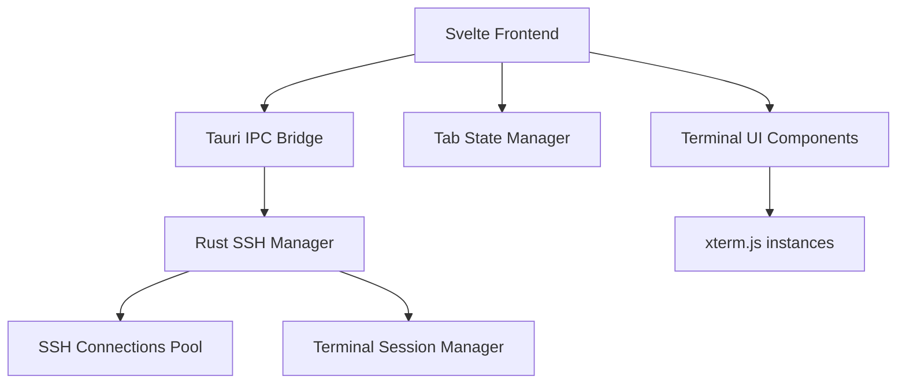

# Design Document

## Overview

This design implements SSH connection management and tabbed interface functionality for the Hana Tauri application. The system uses a hybrid architecture where SSH connections are managed on the Rust backend using modern SSH libraries, while the frontend uses Svelte 5 runes for reactive state management and xterm.js for terminal rendering. The design prioritizes security, performance, and maintainability while avoiding SvelteKit routing in favor of component-based state management.

## Architecture

### High-Level Architecture



### Component Layers

1. **Frontend Layer (Svelte 5)**
   - Tab management with runes-based state
   - Terminal UI components using xterm.js
   - SSH connection forms and controls

2. **IPC Layer (Tauri Commands)**
   - Bidirectional communication between frontend and backend
   - Event streaming for terminal data
   - Connection lifecycle management

3. **Backend Layer (Rust)**
   - SSH connection management using `russh`
   - Terminal session handling with `portable-pty`
   - Secure credential management

## Components and Interfaces

### Frontend Components

**Note:** Login functionality will be skipped in the initial implementation. The existing non-descriptive button should be bypassed to go directly to the SSH connection interface.

#### 1. SSH Connection Manager (`SSHManager.svelte`)
```typescript
interface SSHConnectionConfig {
  id: string;
  name: string;
  hostname: string;
  port: number;
  username: string;
  authMethod: 'password' | 'publickey' | 'agent';
  privateKeyPath?: string;
  password?: string;
}

interface SSHConnectionState {
  id: string;
  status: 'connecting' | 'connected' | 'disconnected' | 'error';
  error?: string;
  lastActivity: Date;
}
```

#### 2. Tab Manager (`TabManager.svelte`)
```typescript
interface TabState {
  id: string;
  title: string;
  connectionId: string;
  isActive: boolean;
  terminalState: TerminalState;
}

interface TerminalState {
  scrollback: string[];
  currentLine: string;
  cursorPosition: number;
  size: { cols: number; rows: number };
}
```

#### 3. Terminal Component (`Terminal.svelte`)
- Wraps xterm.js functionality
- Handles terminal input/output
- Manages terminal resizing and scrollback

### Backend Components

#### 1. SSH Manager (Rust)
```rust
pub struct SSHManager {
    connections: HashMap<String, SSHConnection>,
    event_sender: mpsc::Sender<SSHEvent>,
}

pub struct SSHConnection {
    id: String,
    session: russh::client::Handle<russh::client::Session>,
    channel: Option<russh::Channel<russh::client::Msg>>,
    pty: Option<portable_pty::PtyPair>,
}

pub enum SSHEvent {
    Connected(String),
    Disconnected(String),
    Data(String, Vec<u8>),
    Error(String, String),
}
```

#### 2. Tauri Commands
```rust
#[tauri::command]
async fn create_ssh_connection(config: SSHConnectionConfig) -> Result<String, String>;

#[tauri::command]
async fn send_terminal_input(connection_id: String, data: String) -> Result<(), String>;

#[tauri::command]
async fn resize_terminal(connection_id: String, cols: u16, rows: u16) -> Result<(), String>;

#[tauri::command]
async fn disconnect_ssh(connection_id: String) -> Result<(), String>;
```

### State Management with Svelte 5 Runes

#### Connection State
```typescript
// stores/ssh.svelte.ts
export class SSHStore {
  connections = $state<Map<string, SSHConnectionState>>(new Map());
  activeConnections = $derived(
    Array.from(this.connections.values()).filter(c => c.status === 'connected')
  );
  
  addConnection(config: SSHConnectionConfig) {
    // Implementation
  }
  
  updateConnectionStatus(id: string, status: SSHConnectionState['status']) {
    // Implementation
  }
}
```

#### Tab State
```typescript
// stores/tabs.svelte.ts
export class TabStore {
  tabs = $state<TabState[]>([]);
  activeTabId = $state<string | null>(null);
  
  activeTab = $derived(
    this.tabs.find(tab => tab.id === this.activeTabId)
  );
  
  createTab(connectionId: string, title: string): string {
    // Implementation
  }
  
  closeTab(tabId: string) {
    // Implementation
  }
  
  switchTab(tabId: string) {
    // Implementation
  }
}
```

## Data Models

### SSH Connection Configuration
```typescript
interface SSHConnectionConfig {
  id: string;
  name: string;
  hostname: string;
  port: number;
  username: string;
  authMethod: 'password' | 'publickey' | 'agent';
  privateKeyPath?: string;
  password?: string; // Handled securely, not persisted
}
```

### Terminal Session Data
```typescript
interface TerminalSession {
  id: string;
  connectionId: string;
  buffer: string;
  scrollPosition: number;
  size: { cols: number; rows: number };
  isActive: boolean;
}
```

### Application State
```typescript
interface AppState {
  connections: Map<string, SSHConnectionState>;
  tabs: TabState[];
  activeTabId: string | null;
  terminalSessions: Map<string, TerminalSession>;
}
```

## Error Handling

### Connection Errors
- **Authentication Failures**: Display specific error messages for invalid credentials
- **Network Errors**: Handle connection timeouts and network unreachability
- **SSH Protocol Errors**: Manage SSH handshake and protocol-level failures

### Terminal Errors
- **PTY Allocation Failures**: Graceful fallback when pseudo-terminal allocation fails
- **Data Transmission Errors**: Handle broken pipes and connection drops
- **Terminal Resize Errors**: Manage terminal size synchronization issues

### State Management Errors
- **Tab State Corruption**: Recover from invalid tab states
- **Connection State Desync**: Synchronize frontend and backend connection states
- **Memory Management**: Prevent memory leaks from unclosed connections

## Testing Strategy

### Unit Tests
- **SSH Connection Logic**: Test connection establishment, authentication, and cleanup
- **Tab Management**: Test tab creation, switching, and closure
- **State Management**: Test runes-based state updates and derivations

### Integration Tests
- **SSH to Terminal Flow**: Test end-to-end SSH connection to terminal display
- **Multi-tab Scenarios**: Test multiple simultaneous SSH connections
- **Error Recovery**: Test graceful handling of connection failures

### Security Tests
- **Credential Handling**: Ensure passwords and keys are not logged or persisted insecurely
- **Connection Isolation**: Verify that tab sessions don't interfere with each other
- **Resource Cleanup**: Test that closed connections properly release resources

### Performance Tests
- **Connection Scaling**: Test performance with multiple simultaneous connections
- **Terminal Rendering**: Test xterm.js performance with high-throughput output
- **Memory Usage**: Monitor memory consumption during extended sessions